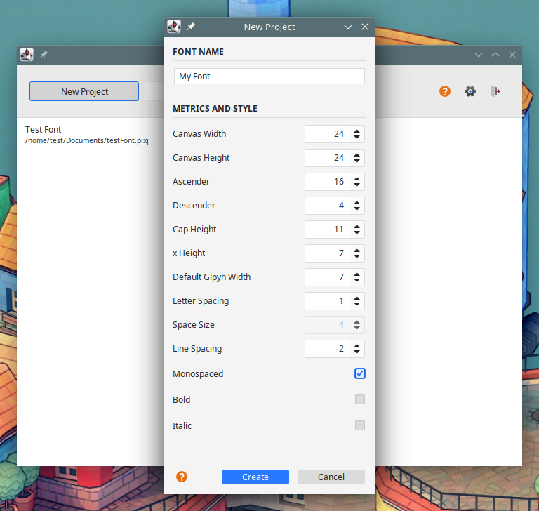
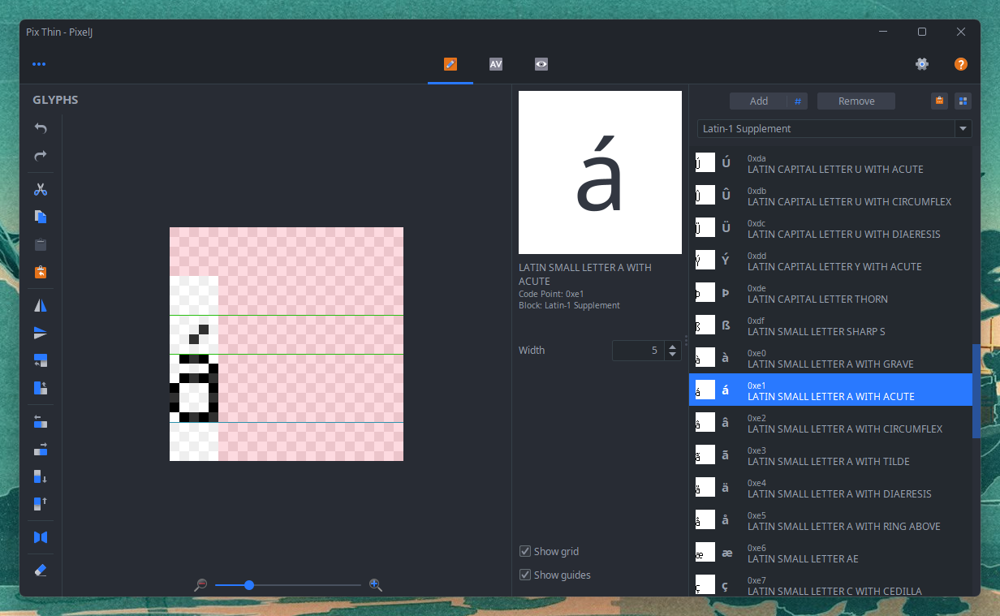

# PixelJ

My pixel font editor (redux), still in its early stages. It can export
[AngelCode BMFont](http://www.angelcode.com/products/bmfont/) files, or SVGs optionally accompanied with a script to
generate a FontForge project.

You can find pre-compiled Windows and Linux packages on the [releases](https://github.com/mimoguz/pixelj/releases) page.





## Engine/Framework Support

LibGDX, and (as far as I know) Godot use BMFont config format for bitmap fonts. MonoGame.Extended package adds
BMFont support to MonoGame.

## Creating OTF/TTF

Load a project, and from the menu select _"Export SVG"_ command (shortcut Ctrl + Shift + E). On the opened dialog, select a directory to save the exported files and press _"Export"_. If you didn't uncheck the option, this will also create a file with _.pe_ extension. Open the save directory in the terminal and run (assuming you have FontForge installed and on the path)

```
fontforge -script <file_name>.pe
```

Now you will see a new file with _.sfd_ extension. You can open it using FontForge and export your font from there.


## Building

You'll need JDK 18 and Maven. Then, open a terminal in the project root and run

    mvn package

If everything went OK, you should see two zip files in the target folder: one that also contains a
minimal Java runtime environment, other that doesn't.
