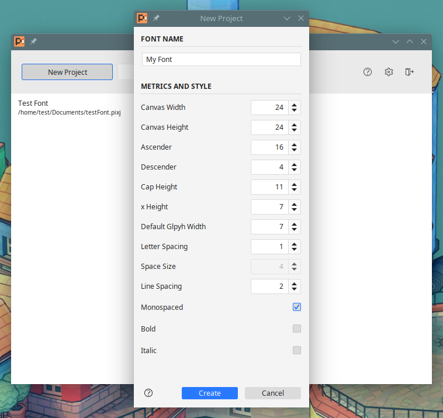
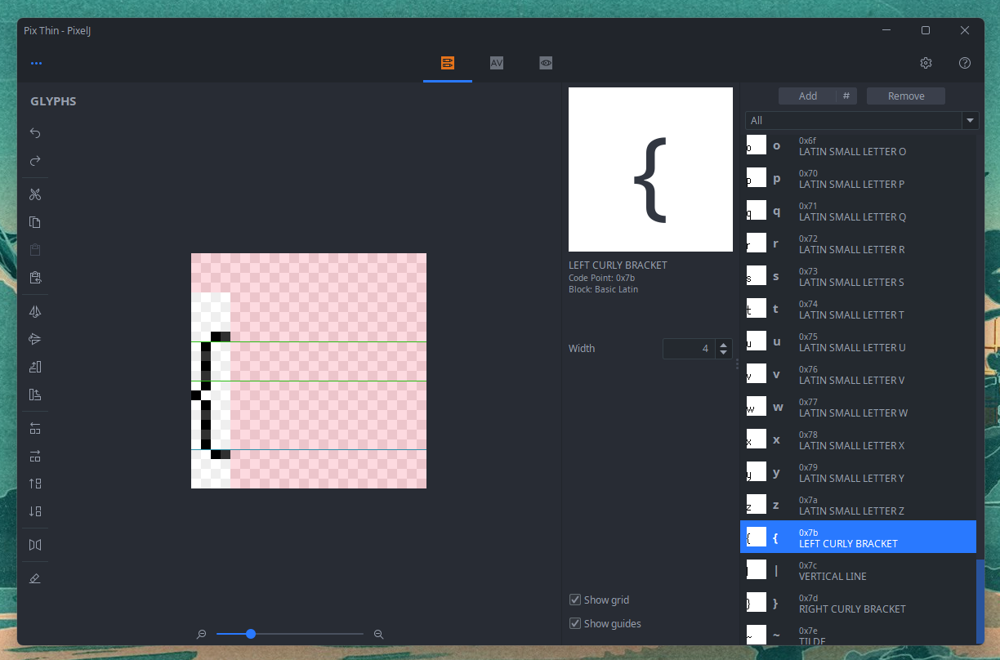

# PixelJ

My pixel font editor (redux), still in its early stages. It can export
[AngelCode BMFont](http://www.angelcode.com/products/bmfont/) files.

You can find pre-compiled Windows and Linux packages on the [releases](https://github.com/mimoguz/pixelj/releases) page.

## Engine/Framework Support

LibGDX, and (as far as I know) Godot use BMFont config format for bitmap fonts. MonoGame.Extended package adds
BMFont support to MonoGame.

## Building

You'll need JDK 18 and Maven. Then, open a terminal in the project root and run

    mvn package

If everything went OK, you should see two zip files in the target folder: one that also contains a
minimal Java runtime environment, other that doesn't.
